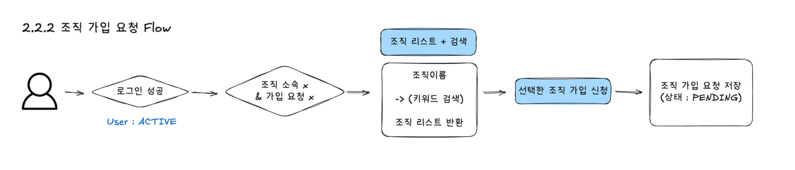
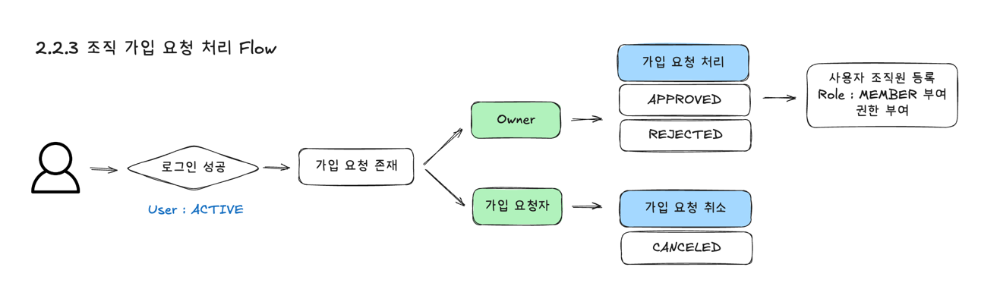

# 📝 2.2.1 가입 가능한 조직 조회

## 기능 목적

> 사용자가 가입 가능한 조직을 조회한다.

## 사전 조건

- 로그인한 사용자여야 한다.
- 현재 `ACTIVE` 상태의 조직 소속이 없어야 한다.
- 진행 중(`PENDING`)인 조직 가입 요청이 없어야 한다.

## 입력값

| 항목 | 형식 | 필수 여부 | 설명 |
| --- | --- | :---: | --- |
| 조직명 | String | X | 조직명 검색어 |

## 처리 절차

1. 로그인 여부를 확인한다.
2. 사용자의 조직 소속 여부 / 가입 요청 여부를 확인한다.
3. 가입 가능한 조직을 조회한다.
4. 검색 조건에 따라 조직 목록을 반환한다.

## 업무 규칙

- 조직에 가입되지 않은 회원만 조회할 수 있다.
- `ACTIVE` 상태의 조직만 조회할 수 있다.
- 조직명으로 검색할 수 있다.

## 처리 결과

- [ ] 가입 가능한 조직 목록을 반환한다.

# 📝 2.2.2 조직 가입 요청

## 기능 목적

> 사용자가 조직에 가입을 요청한다.

## 사전 조건

- 로그인한 사용자여야 한다.
- 회원 상태가 `ACTIVE`여야 한다.
- 현재 `ACTIVE` 상태의 조직 소속이 없어야 한다.
- 진행 중(`PENDING`)인 가입 요청이 없어야 한다.
- 가입 대상 조직이 `ACTIVE` 상태여야 한다.

## 입력값

| 항목  | 형식     | 필수 여부 | 설명 |
|-----|--------| :---: | --- |
| 조직명 | String | O | 가입을 요청할 조직 |

## 처리 절차

## 업무 규칙

- `ACTIVE` 회원만 가입 요청할 수 있다.
- 하나의 회원은 하나의 조직에만 가입 요청할 수 있다.
- 가입 요청 상태는 `PENDING`으로 생성한다.
- `ACTIVE` 상태의 조직만 가입 요청할 수 있다.

## 처리 결과

- [ ] 조직 가입 요청이 생성된다.
- [ ] 가입 요청 상태가 `PENDING`으로 저장된다.

## 예외 처리

| 예외 조건 | 처리 |
| --- | --- |
| 이미 조직에 소속된 사용자 | 가입 요청을 거부한다. |
| 진행 중인 가입 요청이 존재함 | 가입 요청을 거부한다. |
| 조직 상태가 `ACTIVE`가 아님 | 가입 요청을 거부한다. |

---

# 📝 2.2.3 조직 가입 요청 처리

## 기능 목적

> 가입 요청을 승인, 거절 또는 취소한다.

## 사용자 및 권한

- `OWNER` : 승인, 거절
- 가입 요청자 : 취소

## 사전 조건

- 로그인한 사용자여야 한다.
- 가입 요청 상태가 `PENDING`이어야 한다.

## 입력값

| 항목       | 형식 | 필수 여부 | 설명                                                                    |
|----------| --- |:-----:|-----------------------------------------------------------------------|
| 가입 요청 ID | Long |   O   | 처리할 가입 요청                                                             |
| 처리 유형    | Enum |   O   | `APPROVED`, `REJECTED`, `CANCELED`                                    |
| 권한       | Enum |   X   | 승인 시 지정 :`INVENTORY_MANAGE`, `ENVIRONMENT_MANAGE`, `OPERATION_MANAGE` |

## 처리 절차

## 업무 규칙

- `OWNER`만 가입 요청을 승인하거나 거절할 수 있다.
- 가입 요청 생성자만 자신의 가입 요청을 취소할 수 있다.
- `PENDING` 상태의 가입 요청만 처리할 수 있다.
- 승인 시 가입 요청 상태를 `APPROVED`로 변경한다.
- 승인 시 `OWNER`는 사용자의 권한을 지정해준다.
- 승인된 사용자는 조직의 `MEMBER`가 된다.
- 거절 시 가입 요청 상태를 `REJECTED`로 변경한다.
- 취소 시 가입 요청 상태를 `CANCELED`로 변경한다.

## 처리 결과

- [ ] 가입 요청 상태가 처리 결과에 따라 변경된다.
- [ ] 승인 시 사용자가 조직원으로 등록된다.
- [ ] 승인 시 사용자에게 `MEMBER` 역할이 부여된다.
- [ ] 승인 시 사용자에게 권한이 부여된다.

## 예외 처리

| 예외 조건 | 처리           |
| --- |--------------|
| `OWNER` 권한이 아님(승인/거절) | 권한 없음을 반환한다. |
| 가입 요청 생성자가 아님(취소) | 권한 없음을 반환한다. |
| 가입 요청 상태가 `PENDING`이 아님 | 요청을 거부한다.    |
