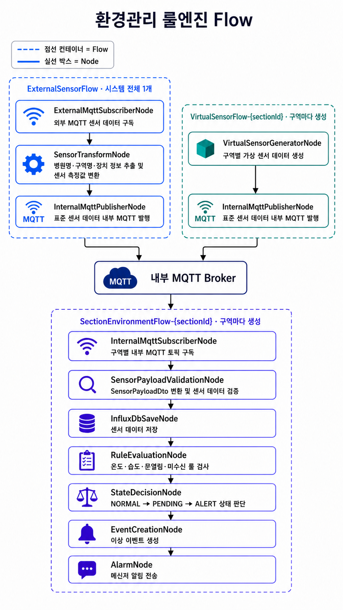

# 📝 4.0 환경관리 전체 흐름

## 기능 구성

| 구분 | 책임 |
| --- | --- |
| 4.1 센서 데이터 수집 및 표준화 | 외부 MQTT 수신, 센서 종류별 변환, 위치 식별, 내부 MQTT 발행 |
| 4.2 내부 센서 데이터 수신 및 위치별 분배 | 내부 MQTT 수신·검증, `locationId` 기준 분배 |
| 4.3 위치별 센서 데이터 저장 및 임계값 판단 | InfluxDB 저장, 임계값 이탈 지속 시간 판단, `AlarmNode` 전달 |
| 4.4 가상 센서 관리 | 위치별 가상 센서값 생성, 내부 MQTT 발행 |
| 4.5 알림 처리 | `AlarmNode`가 받은 알림 대상 데이터를 메신저 알림으로 전송 |
| 4.6 Flow 및 룰 설정 관리 | 위치별 Flow 생명주기와 룰 설정 관리 |

## 공통 원칙

- 모든 센서 데이터는 동일한 표준 데이터 형식과 내부 MQTT 토픽 규칙을 사용한다.
- `locationId`는 위치별 분배와 상태 관리의 기준이다.
- 임계값 이탈이 지속 시간을 초과한 데이터만 `AlarmNode`를 거쳐 4.5에서 알림으로 처리한다.
