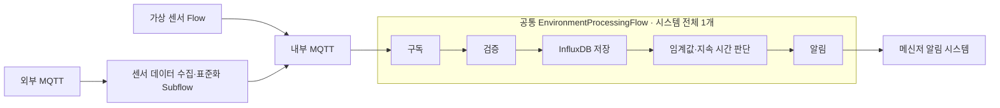

# 📝 4.0 환경관리 전체 흐름

## 기능 구성

| 구분 | 책임 |
| --- | --- |
| 4.1 센서 데이터 수집 및 표준화 | Subflow에서 외부 MQTT 수신, 센서 종류별 변환, 위치 식별, 내부 MQTT 발행 |
| 4.2 공통 센서 데이터 구독 및 검증 | 단일 Flow의 내부 MQTT 구독, 표준 데이터 변환·검증 |
| 4.3 센서 데이터 저장 및 임계값 판단 | 같은 Flow에서 InfluxDB 저장, 위치별 룰 조회, 임계값 이탈 지속 시간 판단 |
| 4.4 가상 센서 관리 | 위치별 가상 센서값 생성, 내부 MQTT 발행 |
| 4.5 알림 처리 | 같은 Flow의 `AlarmNode`가 알림 대상 데이터를 메신저 알림으로 전송 |
| 4.6 Flow 및 룰 설정 관리 | 단일 공통 처리 Flow 생명주기와 위치별 룰·가상 센서 설정 관리 |

## 공통 원칙

- 모든 센서 데이터는 동일한 표준 데이터 형식과 내부 MQTT 토픽 규칙을 사용한다.
- 표준화 Subflow 뒤에는 시스템 전체에 하나의 `EnvironmentProcessingFlow`만 실행한다.
- 공통 Flow는 `구독 → 검증 → 저장 → 판단 → 알림` 순서를 유지하며 위치별 Flow로 분배하지 않는다.
- `locationId`는 Flow 분배 기준이 아니라 저장 Tag, 룰 조회, 이탈 상태 관리의 기준이다.
- 임계값 이탈이 지속 시간을 초과한 데이터만 같은 Flow의 `AlarmNode`로 전달한다.
