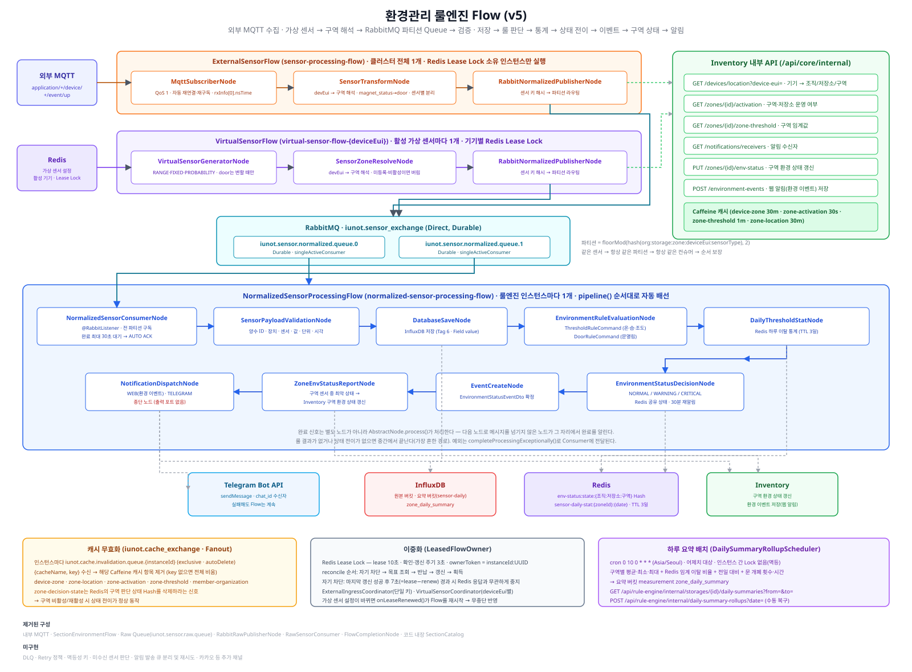

# 📝 4.0 환경관리 전체 흐름

## 현재 구현 구조

환경관리 룰엔진은 외부 MQTT로 수집한 데이터를 수집 Flow 안에서 바로 표준화해 RabbitMQ 파티션 Normalized Queue로 보내고, 룰 판단·통계 집계·상태 전이·이벤트 생성·구역 상태 반영·알림 발송까지를 하나의 `NormalizedSensorProcessingFlow`에서 처리한다. 위치·임계값·알림 수신자·환경 이벤트는 모두 Inventory 서비스의 내부 API(`/api/core/internal/**`)와 실제로 주고받는다.

| Flow | Flow ID | 생성 기준 | 구성 | 책임 |
| --- | --- | --- | --- | --- |
| 외부 센서 수집 | `sensor-processing-flow` | 클러스터 전체 1개 | `MqttSubscriberNode` → `SensorTransformNode` → `RabbitNormalizedPublisherNode` | 외부 MQTT 구독, `deviceEui` 기준 구역 해석·센서별 표준 변환, 파티션 Normalized Queue 발행 |
| 가상 센서 | `virtual-sensor-flow-{deviceEui}` | 활성 가상 센서별 1개 | `VirtualSensorGeneratorNode` → `SensorZoneResolveNode` → `RabbitNormalizedPublisherNode` | 가상 센서 생성, 구역 해석, 파티션 Normalized Queue 발행 |
| 표준 센서 처리 | `normalized-sensor-processing-flow` | 룰엔진 인스턴스별 1개 | `NormalizedSensorConsumerNode` → `SensorPayloadValidationNode` → `DatabaseSaveNode` → `EnvironmentRuleEvaluationNode` → `DailyThresholdStatNode` → `EnvironmentStatusDecisionNode` → `EventCreateNode` → `ZoneEnvStatusReportNode` → `NotificationDispatchNode` | 표준 메시지 소비, 검증, InfluxDB 저장, 룰 판단, 하루 통계 집계, 상태 전이, 이벤트 생성, 구역 환경 상태 반영, 알림 발송 |

- Raw Queue(`iunot.sensor.raw.queue`)와 `RawSensorConsumer`는 제거되었다. 표준 변환은 메모리 연산뿐이라 별도 Queue를 거치지 않고 수집 Flow 안의 `SensorTransformNode`에서 처리한다.
- `NormalizedSensorConsumerNode`는 `@RabbitListener`를 가진 Spring Bean이자 `NormalizedSensorProcessingFlow`의 시작 Node다.
- 별도의 `FlowCompletionNode`는 없다. 완료 신호는 `AbstractNode.process()`가 "다음 노드로 메시지를 넘기지 않았으면 그 자리에서 완료"로 일괄 처리한다.
- `NormalizedSensorProcessingFlow`의 파이프라인은 `pipeline()` 목록의 나열 순서대로 자동 배선된다. 순서를 바꾸거나 노드를 끼워 넣을 때 이 목록만 고치면 된다.

## 처리 순서

1. Redis Lease Lock을 획득한 인스턴스가 `ExternalSensorFlow`를 실행하여 외부 MQTT 메시지를 수신한다.
2. `SensorTransformNode`가 `SensorTransformService`를 호출해 `deviceEui`로 Inventory에서 구역(조직·저장소·구역)을 해석하고, 원본 메시지 하나를 센서 종류별 `SensorPayload` 여러 건으로 나눠 내보낸다.
3. `RabbitNormalizedPublisherNode` → `NormalizedSensorPublisher`가 `organizationId:storageId:zoneId:deviceEui:sensorType`을 해시해 2개 파티션 중 하나의 Normalized Queue(`iunot.sensor.normalized.queue.0~1`)에 발행한다.
4. 활성 가상 센서의 `VirtualSensorFlow-{deviceEui}`도 `SensorZoneResolveNode`로 같은 방식의 구역 해석을 거친 뒤, 같은 파티셔닝 규칙으로 Normalized Queue에 발행한다.
5. 인스턴스별 `NormalizedSensorProcessingFlow`가 모든 파티션 Queue를 구독하며, 각 파티션은 `singleActiveConsumer`로 항상 같은 컨슈머가 처리해 같은 센서의 메시지 순서를 보장한다.
6. `SensorPayloadValidationNode`가 표준 데이터를 검증하고, `DatabaseSaveNode`가 InfluxDB에 저장한다.
7. `EnvironmentRuleEvaluationNode`가 센서 타입에 맞는 `EnvironmentRuleCommand`(`ThresholdRuleCommand` 또는 `DoorRuleCommand`)로 룰을 판단한다.
8. `DailyThresholdStatNode`가 임계값 판단 결과를 그 시점에 Redis로 하루 단위 집계한다(4.8의 하루 요약이 사용).
9. `EnvironmentStatusDecisionNode`가 Redis에 저장된 이전 상태와 비교해 `NORMAL/WARNING/CRITICAL` 상태를 판단하고, 전이가 있으면 이벤트 판단 결과를 만든다.
10. `EventCreateNode`가 최종 `EnvironmentStatusEventDto`를 생성한다.
11. `ZoneEnvStatusReportNode`가 그 구역 센서들의 상태 중 가장 나쁜 값을 구역 환경 상태로 확정해 Inventory에 반영한다.
12. `NotificationDispatchNode`가 알림 수신자를 조회해 채널별로 발송하고, 출력 포트가 없으므로 여기서 Flow가 끝나며 완료 신호가 RabbitMQ Listener로 전달된다.

## 구현 상태

| 상태 | 기능 |
| --- | --- |
| Flow 연결 완료 | 외부 MQTT 수집, 수집 Flow 내 구역 해석·표준 변환, 파티션 Normalized Queue 전달, 가상 센서 생성 및 설정 무중단 반영, 표준 데이터 검증, InfluxDB 저장, 온·습도·조도 임계값 검사, 문열림 검사, `NORMAL/WARNING/CRITICAL` 판단(Redis 상태 공유), 하루 임계값 통계 집계, 환경 이벤트 생성, 구역 환경 상태 반영, 웹(환경 이벤트 저장)·텔레그램 알림 발송 |
| 외부 연동 완료 | Inventory 내부 API 연동 — 기기 위치 조회, 구역 활성 여부 조회, 구역 임계값 조회, 알림 수신자 조회, 환경 이벤트 생성, 구역 환경 상태 갱신, 계정 소속 조직 조회. Caffeine 캐시 + RabbitMQ Fanout 기반 캐시 무효화 적용 |
| 보고서 | 하루 요약(구역별 평균·최소·최대·임계 이탈 비율·전일 대비, 문 개폐 횟수·누적 시간) 적재 배치와 조회 API |
| 미구현 | 카카오 등 추가 알림 채널, 알림 전송 실패 복구용 재시도 큐, 미수신 센서 판단, DLQ·Retry·멱등 처리 |

## 공통 원칙

- 위치는 코드에 박힌 카탈로그가 아니라 `deviceEui`로 Inventory에 조회해 채운다(`ZoneResolver` → `CachedZoneLookup` → `InventoryClient`). 실제 센서와 가상 센서 모두 같은 경로를 쓴다.
- 구역이나 저장소가 비활성이면 그 구역의 데이터는 해석 단계에서 끊긴다. 저장·룰 판정·상태 갱신·이벤트·알림이 한꺼번에 멈추고, 다시 활성으로 바꾸면 캐시가 만료되는 대로 저절로 복구된다.
- 실제 센서와 가상 센서는 동일한 `SensorPayload`와 파티션 Normalized Queue를 사용한다.
- 지원 센서 종류는 `temperature`, `humidity`, `door`, `illumination`이다.
- 파티션 수(`SENSOR_NORMALIZED_PARTITION_COUNT`)는 2이며, 발행·구독 양쪽이 같은 상수를 사용한다.
- 사용자용 조회·관리 API는 JWT 인증 후 `OrganizationAccessService`가 소속 조직과 역할, 구역 소유 조직까지 검증한다. 서비스 간 호출 경로는 `/api/rule-engine/internal/**`로 분리한다.
- 이중화 상세는 [4.7 룰엔진 이중화](./7.룰엔진%20이중화.md)에서 관리한다.

## 세부 문서

| 문서 | 내용 |
| --- | --- |
| 4.1 | 외부 센서 수집, 구역 해석 및 표준화 |
| 4.2 | Normalized Flow의 검증, 저장 및 조회 |
| 4.3 | 환경 룰 검사와 이상 상태 판단 |
| 4.4 | 가상 센서 생성 및 활성 상태 관리 |
| 4.5 | 환경 이벤트와 채널별 알림 |
| 4.6 | Flow 생명주기 및 비동기 처리 |
| 4.7 | Redis Lease Lock과 RabbitMQ 파티션을 이용한 이중화 |
| 4.8 | 하루 환경 요약 적재 및 조회 |
