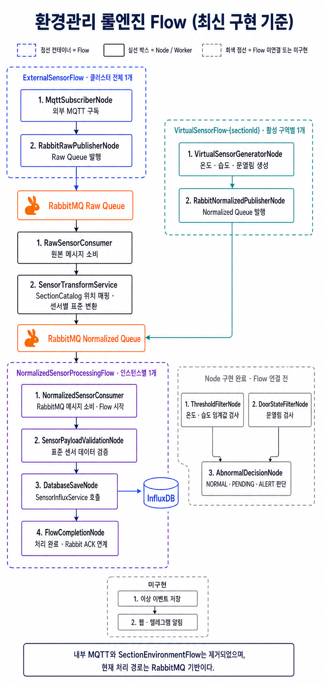

# 📝 4.0 환경관리 전체 흐름

## 현재 구현 구조

환경관리 룰엔진의 현재 처리 경로는 외부 MQTT로 데이터를 수집한 뒤 RabbitMQ의 Raw Queue와 Normalized Queue를 거치는 구조다. 내부 MQTT와 `SectionEnvironmentFlow`는 제거되었다.

| 구분 | 생성 기준 | 구성 | 책임 |
| --- | --- | --- | --- |
| `ExternalSensorFlow` | 클러스터 전체 1개 | `MqttSubscriberNode` → `RabbitRawPublisherNode` | 외부 MQTT 구독 및 Raw Queue 발행 |
| Raw 처리 Worker | 인스턴스별 Consumer | `RawSensorConsumer` → `SensorTransformService` → `NormalizedSensorPublisher` | 위치 매핑, 센서별 표준 변환 및 Normalized Queue 발행 |
| `VirtualSensorFlow-{sectionId}` | 활성 구역별 1개 | `VirtualSensorGeneratorNode` → `RabbitNormalizedPublisherNode` | 가상 센서 생성 및 Normalized Queue 발행 |
| `NormalizedSensorProcessingFlow` | 룰엔진 인스턴스별 1개 | `NormalizedSensorConsumer` → `SensorPayloadValidationNode` → `DatabaseSaveNode` → `FlowCompletionNode` | 표준 메시지 소비, 검증, InfluxDB 저장 및 처리 완료 통지 |

`RawSensorConsumer`와 `SensorTransformService`는 Flow 밖의 RabbitMQ Consumer·Service다. 반면 `NormalizedSensorConsumer`는 리팩터링 이후 `NormalizedSensorProcessingFlow`의 시작 Node로 동작한다.

## 처리 순서

1. Redis Lock을 획득한 인스턴스가 `ExternalSensorFlow`를 실행하여 외부 MQTT 메시지를 수신한다.
2. 원본 메시지를 `iunot.sensor.raw.queue`에 발행한다.
3. `RawSensorConsumer`와 `SensorTransformService`가 위치를 매핑하고 센서 종류별 `SensorPayload`로 변환한다.
4. 변환된 실제 센서 데이터를 `iunot.sensor.normalized.queue`에 발행한다.
5. 활성 구역의 `VirtualSensorFlow-{sectionId}`도 가상 센서 데이터를 같은 Normalized Queue에 발행한다.
6. 인스턴스별 `NormalizedSensorProcessingFlow`가 경쟁 Consumer 방식으로 메시지를 한 건씩 가져간다.
7. Flow가 표준 데이터를 검증하고 InfluxDB에 저장한다.
8. `FlowCompletionNode`가 완료 신호를 보내면 RabbitMQ Listener 처리가 종료된다.

## 구현 상태

| 상태 | 기능 |
| --- | --- |
| Flow 연결 완료 | 외부 MQTT 수집, Raw/Normalized Queue 전달, 실제 센서 표준 변환, 가상 센서 생성, 표준 데이터 검증, InfluxDB 저장 |
| Node 구현 완료·Flow 연결 전 | 온·습도 임계값 검사, 문열림 검사, `NORMAL/PENDING/ALERT` 판단 |
| 미구현 | 이상 이벤트 저장, 웹·텔레그램 알림, 가상 센서 종류 선택, 환경 룰 설정 API·영속 저장 |

## 공통 원칙

- 위치 변환은 `SensorTransformService`가 임시 `SectionCatalog`를 통해 수행한다.
- 실제 센서와 가상 센서는 동일한 `SensorPayload`와 Normalized Queue를 사용한다.
- 지원 센서 종류는 `temperature`, `humidity`, `door`다.
- 규칙 Node 클래스가 존재하더라도 `NormalizedSensorProcessingFlow`에 연결되기 전에는 운영 경로에서 실행되지 않는다.
- 이중화 상세는 [4.7 룰엔진 이중화](./7.룰엔진%20이중화.md)에서 관리한다.

## 세부 문서

| 문서 | 내용 |
| --- | --- |
| 4.1 | 외부 센서 수집, 위치 매핑 및 표준화 |
| 4.2 | Normalized Flow의 검증, 저장 및 조회 |
| 4.3 | 환경 룰 검사와 이상 상태 판단 |
| 4.4 | 가상 센서 생성 및 활성 상태 관리 |
| 4.5 | 환경 이벤트와 채널별 알림 예정 명세 |
| 4.6 | Flow 생명주기 및 비동기 처리 |
| 4.7 | Redis Lock과 RabbitMQ를 이용한 이중화 |
