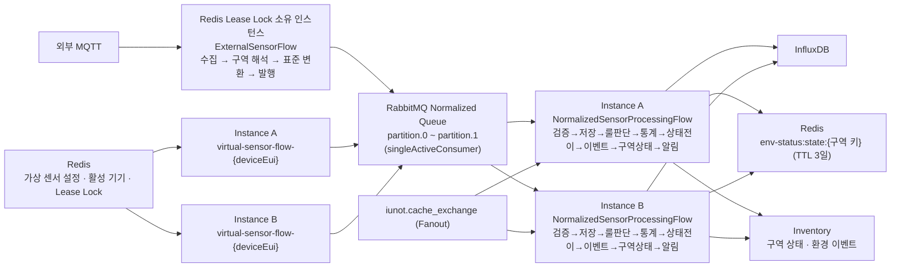

# 📝 4.7 룰엔진 이중화

## 목적

여러 룰엔진 인스턴스에서 외부 MQTT 중복 구독과 가상 센서 중복 생성을 방지하고, RabbitMQ 파티션 Queue로 검증·저장·룰 판단 부하를 분산하면서도 같은 센서의 메시지 순서를 보장한다.

## 구성

Raw Queue와 `RawSensorConsumer`가 제거되면서, 구역 해석과 표준 변환은 수집 Flow를 소유한 인스턴스 한 곳에서 수행된다. 분산의 축은 파티션 Normalized Queue 하나로 단순해졌다.

## 이중화 정책

| 대상 | 조정 방식 | 실행 단위 |
| --- | --- | --- |
| 외부 MQTT 수집 및 표준 변환 | Redis Lease Lock | 클러스터 전체 1개 |
| 가상 센서 생성 | `deviceEui`별 Redis Lease Lock | 활성 가상 센서마다 1개 |
| 표준 데이터 검증·저장·룰 판단·알림 | RabbitMQ 파티션 Queue(`singleActiveConsumer`) + 인스턴스별 Flow | 파티션마다 고정된 한 Flow |
| 환경 상태 판단(`NORMAL/WARNING/CRITICAL`) | Redis 공유 상태 + 파티션 단위 단일 컨슈머 | 센서 키(`org:storage:zone:deviceEui:sensorType`)마다 항상 같은 인스턴스에서 순차 갱신 |
| Inventory 조회 캐시 | 인스턴스별 Caffeine + Fanout 무효화 | 인스턴스마다 사본, 변경 시 전 인스턴스 동시 무효화 |
| 하루 요약 적재 배치 | Lock 없음(멱등) | 인스턴스마다 실행되어도 같은 결과 |

## Redis Lease Lock

- 획득 시 TTL을 포함한 `SETNX`(`setIfAbsent`)를 사용한다.
- 소유자는 `instanceId:UUID` 형태의 `ownerToken`으로 구분한다.
- Lua 스크립트가 소유자를 확인한 경우에만 Lock TTL을 갱신하거나 Key를 삭제한다.
- 외부 수집·가상 센서 Lock의 기본 Lease 시간은 10초, 확인·갱신 주기는 3초다(`application.yaml`의 `rule-engine.redundancy.*`). `renew-interval`은 `lease-duration`보다 짧아야 하며 설정 로딩 시 검증된다.
- 소유권을 잃은 인스턴스는 자신이 실행하던 외부 수집 또는 가상 센서 Flow를 중지한다.
- 정상 종료(`ContextClosedEvent`) 시 Flow를 먼저 중지한 뒤 자신이 소유한 Lock만 해제한다.
- 비정상 종료 시 TTL 만료 후 다른 인스턴스가 Lock을 획득한다.
- `RedisLeaseLockService.getOwner()`로 현재 Lock 소유자를 조회할 수 있어 획득 실패 시 진단 로그에 활용한다.

### 자기 차단(Fencing)

Redis가 응답하지 않아 갱신 요청 자체를 보내지 못하면, Lock은 TTL로 만료되는데 인스턴스는 그 사실을 모른 채 Flow를 계속 돌릴 수 있다. `LeasedFlowOwner`는 이를 로컬 시각만으로 막는다.

- 마지막 갱신 **성공** 시각으로부터 `leaseDuration - renewInterval`(기본 7초)이 지나면 Redis 호출 결과와 무관하게 해당 키의 Flow를 중지하고 소유권을 반납한다.
- 이 검사는 매 주기 `desiredKeys()` 조회보다 **먼저** 실행된다. 조회가 실패하는 상황이야말로 자기 차단이 필요한 상황이기 때문이다.
- Redis에 TTL이 실제로 설정되는 시각보다 앞선 시각(요청 직전)을 기준으로 기록해, 오차가 항상 안전한 방향(더 빨리 멈추는 방향)으로 생기게 한다.

## RabbitMQ 파티션 처리와 ACK

- Normalized Queue는 2개(`SENSOR_NORMALIZED_PARTITION_COUNT`) 파티션 Durable Queue로 나뉜다.
- 파티션은 `iunot.sensor.normalized.queue.0~1`, 라우팅 키는 `iunot.sensor.normalized.0~1`이며, `NormalizedSensorPublisher`가 `organizationId:storageId:zoneId:deviceEui:sensorType` 해시(`Math.floorMod(hashCode, 2)`)로 파티션을 결정한다.
- Exchange는 `iunot.sensor_exchange`(Direct, Durable)다.
- 각 파티션 Queue는 `QueueBuilder.singleActiveConsumer()`로 선언되어, 여러 인스턴스가 구독하더라도 파티션마다 항상 하나의 컨슈머만 활성화된다. 같은 센서의 연속 메시지가 서로 다른 인스턴스로 분산되는 문제를 큐 레벨에서 해결한다.
- Listener는 AUTO ACK와 prefetch 10으로 설정되어 있다.
- `NormalizedSensorConsumerNode`는 전체 파이프라인(검증·저장·룰 판단·통계·상태 전이·이벤트·구역 상태·알림)의 완료를 최대 30초 기다린다. 완료 신호는 마지막으로 메시지를 받은 Node가 `AbstractNode` 공통 로직으로 보낸다.
- 정상 완료 후 Listener가 반환되어 ACK 처리로 이어진다.
- 검증 실패는 `AmqpRejectAndDontRequeueException`으로 변환한다.
- DLQ, 명시적인 Retry 정책과 멱등성 키는 설정하지 않았다.

## 캐시 일관성

Inventory 조회 결과는 인스턴스마다 Caffeine 캐시에 사본으로 존재하므로, 원본이 바뀌면 모든 인스턴스에서 함께 비워야 한다.

- Inventory가 `iunot.cache_exchange`(Fanout)에 `{cacheName, key}` 메시지를 발행한다.
- 인스턴스마다 `iunot.cache.invalidation.queue.{instanceId}` 전용 Queue(비영속·exclusive·autoDelete)를 바인딩해 모두가 같은 메시지를 받는다.
- `key`가 없으면 해당 캐시를 전부 비운다. 키 형식이 맞지 않으면 오류 로그만 남긴다.
- `zone-decision-state`는 Caffeine이 아니라 Redis에 있는 판단 상태 Hash를 지우라는 신호다. 구역을 다시 켰을 때 상태 전이가 정상적으로 일어나게 한다.
- 캐시 TTL 자체도 안전망으로 남아 있다(`zone-activation` 30초, `zone-threshold` 1분, `device-zone`/`zone-location` 30분, 미등록·없는 구역 2분).

## 환경 상태 판단의 분산 일관성

`EnvironmentStatusDecisionNode`의 상태(`EnvironmentDecisionState`)는 인스턴스 메모리가 아닌 Redis Hash(`rule-engine:env-status:state:{조직:저장소:구역}`, field=`deviceEui:sensorType`, TTL 3일)에 저장된다.

- 파티션 Queue의 `singleActiveConsumer` 특성으로 같은 센서 키는 항상 같은 인스턴스에서 순차 처리되므로, 읽기 → 판단 → 쓰기 구간에 별도 분산 Lock을 두지 않는다.
- 상태 저장소 자체를 Redis로 공유하기 때문에 파티션 재배치·인스턴스 교체가 일어나도 이전 상태를 이어받아 판단할 수 있다.
- 구역 단위 Hash라 `ZoneEnvStatusService`가 같은 구역 센서들의 상태를 한 번에 읽어 가장 나쁜 값을 고를 수 있다.
- 측정 시각이 저장된 마지막 측정 시각보다 과거인 메시지는 상태를 되돌리지 않고 버린다.
- 게이트웨이 시계가 앞서서 현재보다 1분(`FUTURE_TOLERANCE`) 넘게 미래인 측정 시각도 신뢰하지 않고 버린다. 미래 타임스탬프 하나가 이후 모든 메시지를 "과거"로 만들어 상태를 영구히 막는 것을 방지한다.
- 값 하나가 깨져 역직렬화에 실패하면 상태가 없는 것으로 보고 처음부터 다시 판단한다. 수집까지 멈추지 않는다.

## 하루 요약 배치의 중복 실행

`DailySummaryRollupScheduler`에는 인스턴스 간 Lock이 없다.

- 적재는 같은 태그·시각의 지점을 덮어쓰는 멱등한 동작이다.
- 이탈 비율과 임계값은 판단 시점에 Redis로 모아 둔 값을 읽으므로 어느 인스턴스가 계산해도 결과가 같다.
- 두 인스턴스가 함께 돌아도 손해는 InfluxDB 질의가 두 배가 되는 것뿐이다.

## 장애 시나리오

| 상황 | 처리 |
| --- | --- |
| 외부 수집 인스턴스 종료 | Lock 만료 후 대기 인스턴스가 Lock을 획득하고 수집 Flow를 시작한다. |
| 가상 센서 담당 인스턴스 종료 | 기기 Lock 만료 후 다른 인스턴스가 해당 Flow를 시작한다. |
| Redis 장애로 Lock 갱신 불가 | 갱신 실패가 이어지면 자기 차단 시간(7초) 경과 시 스스로 Flow를 중지한다. |
| Flow 시작 실패 | Lock을 반납해 다음 주기에 다른 인스턴스가 이어받게 한다. |
| RabbitMQ Consumer 종료 | 남아 있는 인스턴스가 해당 파티션의 `singleActiveConsumer`를 새로 획득해 처리를 이어받는다. |
| Normalized Flow 검증 실패 | 메시지를 재큐잉하지 않고 거절한다. |
| Normalized Flow 저장·룰 판단 실패·시간 초과 | 오류를 Listener Container로 전달한다. |
| 환경 상태 Redis 조회·저장 실패 | 해당 메시지 처리가 예외로 끝나 Listener로 오류가 전달된다. |
| Inventory 구역 활성 여부 조회 실패 | 활성으로 간주해 수집을 계속한다. 구역이 정말 없으면 비활성으로 본다. |
| Inventory 임계값 조회 실패 | 예외가 Flow 밖으로 전달되어 해당 메시지가 실패 처리된다. |
| Inventory 알림 수신자 조회 실패 | 경고 로그만 남기고 웹 알림(환경 이벤트 기록)은 그대로 남긴다. |
| 구역 환경 상태 반영 실패 | 경고 로그만 남기고 알림 발송을 계속한다. 다음 이벤트에서 다시 시도된다. |
| 하루 통계 기록 실패 | 경고 로그만 남기고 측정값 저장·알림은 계속한다. |
| 하루 요약 적재 실패 | 저장소·구역 단위로 건너뛰고 나머지를 적재한다. 원본 보관 기간(2일) 안에 수동 재실행할 수 있다. |

## 남은 보완 사항

- DLQ, Retry 정책, 멱등성 키가 없어 처리 실패 메시지의 재처리·추적이 제한적이다.
- 구역 해석과 표준 변환이 수집 Flow 소유 인스턴스 한 곳에 집중되므로, 수집량이 늘면 이 구간이 병목이 될 수 있다.
- 알림 발송이 Flow 안에서 동기로 일어나므로, 채널 응답 지연이 RabbitMQ ACK에 영향을 준다([4.5](./5.환경%20이벤트%20및%20알림%20관리.md) 참고).
- 파티션 수(2개)를 늘리거나 줄일 경우 발행·구독 양쪽이 참조하는 `SENSOR_NORMALIZED_PARTITION_COUNT`를 함께 변경해야 하며, 운영 중 변경 시 큐 재생성이 필요하다.

## 완료 기준

- [x] 외부 MQTT 수집이 클러스터에서 하나만 실행된다.
- [x] 같은 가상 센서의 Flow가 중복 실행되지 않는다.
- [x] Normalized 처리가 파티션 단위로 순서가 보장된 채 분산된다.
- [x] Normalized Flow 완료(룰 판단·이벤트·알림 포함)와 RabbitMQ 처리가 연계된다.
- [x] 환경 상태 판단이 Redis 공유 상태로 인스턴스 교체에도 이어진다.
- [x] Redis 장애 시 자기 차단으로 소유권 없는 Flow 실행을 막는다.
- [x] Inventory 조회 캐시가 Fanout 무효화로 전 인스턴스에서 동시에 갱신된다.
- [ ] DLQ, Retry 및 멱등 처리 정책 (미구현)
