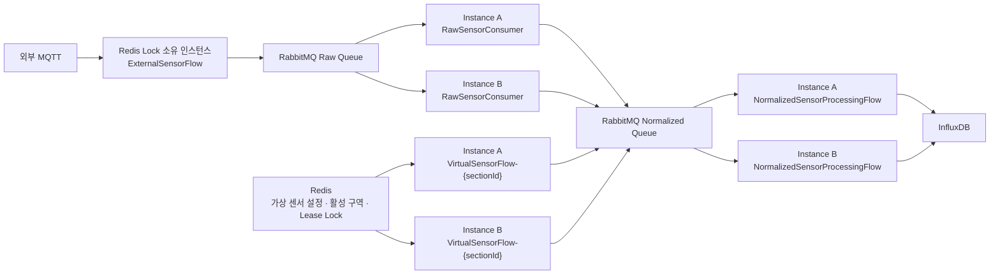

# 📝 4.7 룰엔진 이중화

## 목적

여러 룰엔진 인스턴스에서 외부 MQTT 중복 구독과 가상 센서 중복 생성을 방지하고, RabbitMQ 경쟁 Consumer로 변환·저장 부하를 분산한다.

## 구성

## 이중화 정책

| 대상 | 조정 방식 | 실행 단위 |
| --- | --- | --- |
| 외부 MQTT 수집 | Redis Lease Lock | 클러스터 전체 1개 |
| 가상 센서 생성 | `sectionId`별 Redis Lease Lock | 활성 구역마다 1개 |
| Raw 데이터 변환 | RabbitMQ 경쟁 Consumer | 메시지마다 한 Consumer |
| 표준 데이터 검증·저장 | RabbitMQ 경쟁 Consumer + 인스턴스별 Flow | 메시지마다 한 Flow |

## Redis Lease Lock

- 획득 시 TTL을 포함한 `SETNX`를 사용한다.
- 소유자는 `instanceId:UUID` 형태의 `ownerToken`으로 구분한다.
- Lua 스크립트가 소유자를 확인한 경우에만 Lock TTL을 갱신하거나 Key를 삭제한다.
- 기본 Lease 시간은 10초, 확인·갱신 주기는 3초다.
- 소유권을 잃은 인스턴스는 자신이 실행하던 외부 수집 또는 가상 센서 Flow를 중지한다.
- 정상 종료 시 Flow를 먼저 중지한 뒤 자신이 소유한 Lock만 해제한다.
- 비정상 종료 시 TTL 만료 후 다른 인스턴스가 Lock을 획득한다.

## RabbitMQ 처리와 ACK

- Raw Queue와 Normalized Queue는 Durable Queue다.
- Listener는 AUTO ACK와 prefetch 10으로 설정되어 있다.
- `NormalizedSensorConsumer`는 `FlowCompletionNode`의 완료를 최대 30초 기다린다.
- 정상 완료 후 Listener가 반환되어 ACK 처리로 이어진다.
- 검증 실패는 `AmqpRejectAndDontRequeueException`으로 변환한다.
- DLQ, 명시적인 Retry 정책과 멱등성 키는 아직 설정되어 있지 않다.

## 장애 시나리오

| 상황 | 처리 |
| --- | --- |
| 외부 수집 인스턴스 종료 | Lock 만료 후 대기 인스턴스가 Lock을 획득하고 수집 Flow를 시작한다. |
| 가상 센서 담당 인스턴스 종료 | 구역 Lock 만료 후 다른 인스턴스가 해당 Flow를 시작한다. |
| RabbitMQ Consumer 종료 | 남아 있는 인스턴스의 Consumer가 Queue 처리를 계속한다. |
| Normalized Flow 검증 실패 | 메시지를 재큐잉하지 않고 거절한다. |
| Normalized Flow 저장 실패·시간 초과 | 오류를 Listener Container로 전달한다. |
| Redis 연결 실패 | Lock 획득·갱신을 수행하지 못하며 소유권 유지에 실패한 Flow를 중지한다. |

## 상태 판단 연결 전 필수 보완

`AbnormalDecisionNode`의 상태는 현재 인스턴스 메모리에만 저장된다. Normalized Queue는 경쟁 소비 방식이므로 같은 센서의 연속 데이터가 서로 다른 인스턴스에 전달될 수 있다.

룰 판단을 운영 Flow에 연결하기 전에 다음 중 하나가 필요하다.

- Redis 등 공용 저장소에 이상 상태와 최초 위반 시각 저장
- `organizationId + storageId + sectionId + deviceEui + sensorType` 기반 일관된 라우팅
- 구역 또는 센서 단위 판단 Worker의 단일 소유권 보장

## 완료 기준

- [x] 외부 MQTT 수집이 클러스터에서 하나만 실행된다.
- [x] 같은 구역의 가상 센서 Flow가 중복 실행되지 않는다.
- [x] Raw 변환과 Normalized 저장이 인스턴스에 분산된다.
- [x] Normalized Flow 완료와 RabbitMQ 처리가 연계된다.
- [ ] DLQ, Retry 및 멱등 처리 정책이 추가된다.
- [ ] 상태 판단 데이터의 분산 일관성이 보장된다.
