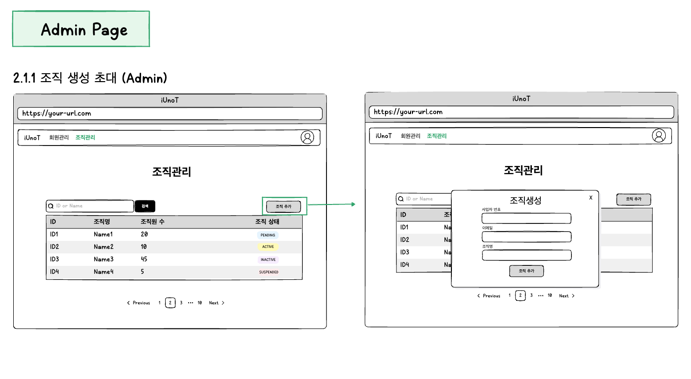
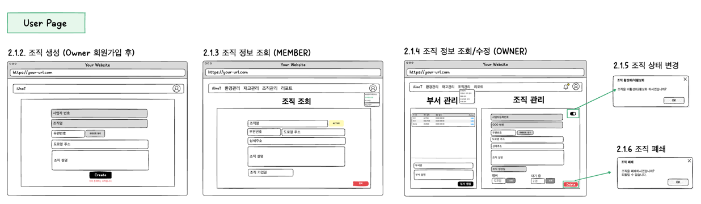
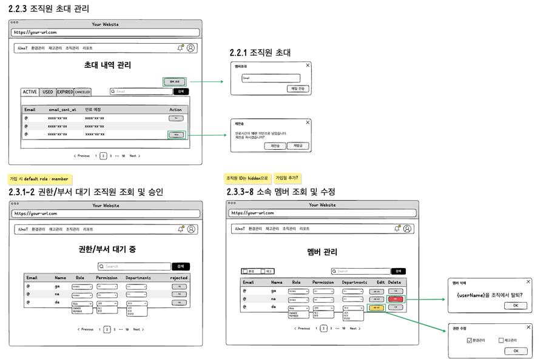

# 조직 / 부서 / 저장소 / 구역
> 문서화 작업 진행 중 .. 저장소/구역은 아직 레이아웃을 잡지 못했음
## 조직 (관리자)
- 관리자 (admin)은 계약을 맺은 조직의 기본 정보로 조직을 생성한다.
- 이때 조직은 PENDING 상태로 생성된다.

## 조직 관리
- admin으로부터 링크를 받아 초대된 첫 번째 조직원(Owner)는 회원가입 후
- 조직 상세 정보 입력 과정을 거친 후 조직 생성을 완료한다.

---

