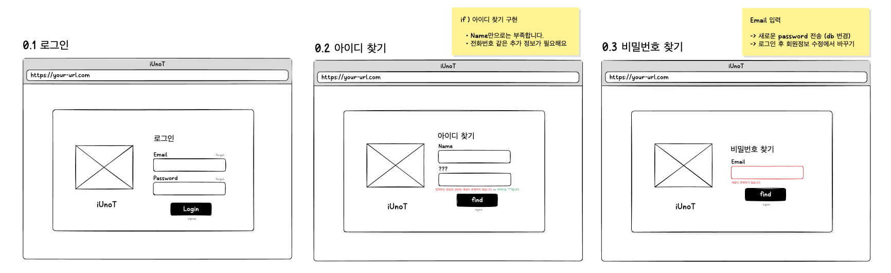
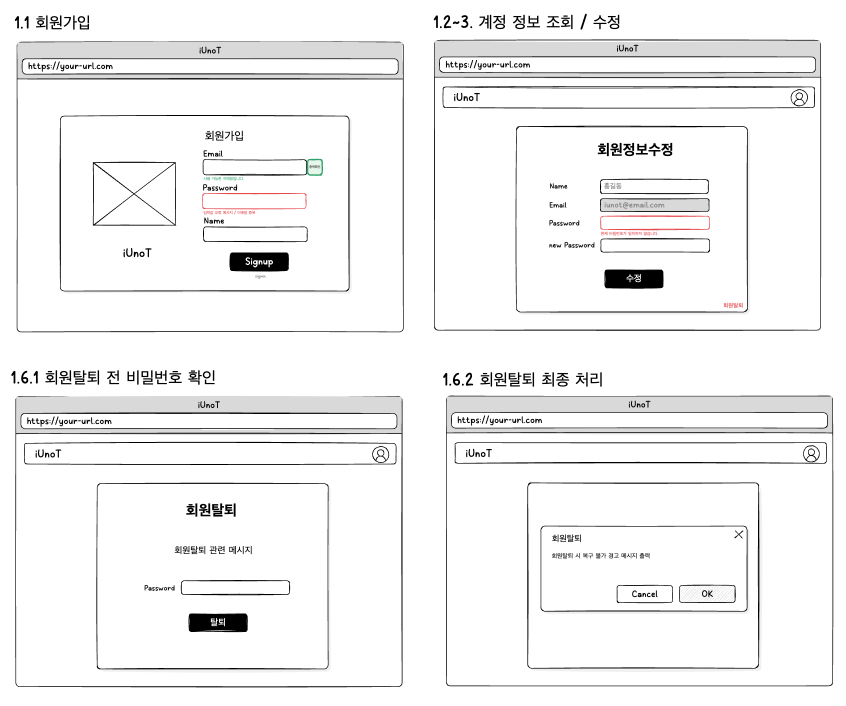
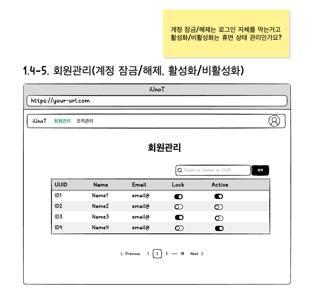

# Account 목업
## 1. 로그인, 아이디 찾기, 비밀번호 찾기 (기능 명세 x)

## Q&A
### 아이디 찾기를 한다면 사용자를 식별할 추가적인 정보가 필요 (ex : name + tel)
   1. 아이디 찾기를 할지 말지 : 
   2. 한다면 어떤 정보를 사용할건지 : 

###  비밀번호 찾기를 한다면 User Email로 새로운 비밀번호 or 코드를 보내는 방식 중 정하기
   1. 비밀번호 찾기를 할지 말지 :
   2. 한다면 어떤 방식으로 할건지 : 

## 2. 회원가입 / 계정 정보 조회-수정 / 회원탈퇴 (기능 명세 회원 : 1.1~3, 1.6)
> 필드 / 메시지 관련 수정은 프론트 구현 시 작업하셔도 될 것 같습니다.

---

## 관리자 페이지 (Admin)
## 3. 조직 관리 (기능 명세 x)
> 이건 조직 관리 쪽에서 생각하겠습니다.

### Q&A
1. 어떤 정보까지 제공을 해줄건지 :
2. 조직을 삭제 or 비활성화 할 권한을 줄건지 :

## 4. 회원관리 (기능명세 회원 : 1.4, 1.5)
### Q&A
1. 계정 잠금/해제와 활성화/비활성화의 차이를 정리해주세요 : 
2. Lock / Active 관리를 어떤 식으로 하고 싶은지 :

